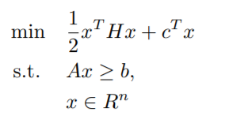
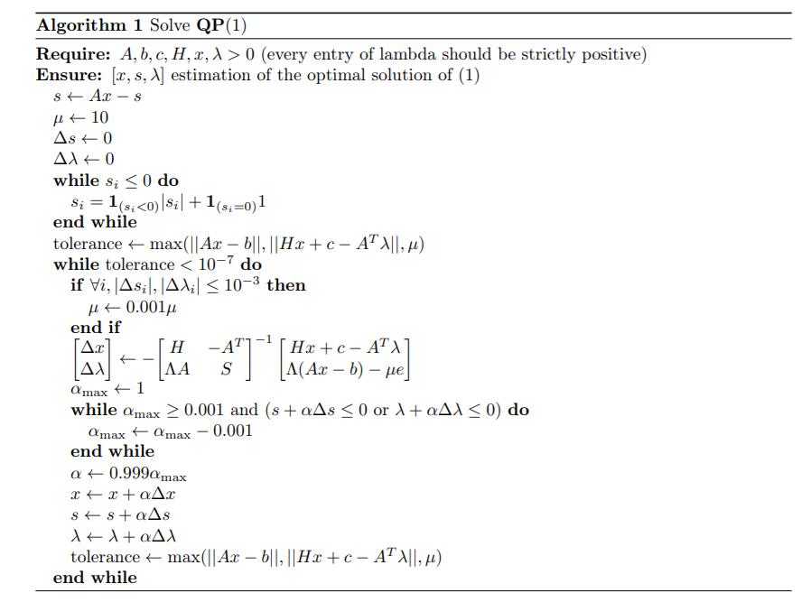

# Interior-Points-Solver-for-Non-Linear-Problems

## Abstract

In this project, two main solvers were constructed. The first one solves Inequality Quadratic Problems (IQP) and the second solves, using sequential quadratic programming (SQP), the more general problems where the objective and the constraints are only assumed to be twice differentiables, both were created using MATLAB. Theory of underlying Quadratic Programming and Sequential Quadratic Programming, and mathematical steps, is explained. Then, a detailed description of the constructed solvers is introduced. Multiple testings was done on the constructed solvers to study their functionality. These tests have been analysed and discussed together while comparing with another solver and providing recommendation for future work.

## Content

- The file qp.m: Solves Inequality Quadratic Problems (IQP) in the form:

 
 
 Where H is a symmetric positive definite matrix.
 
 To so, we developed the following algorithm (Based on Interior Points Method):
 
 

